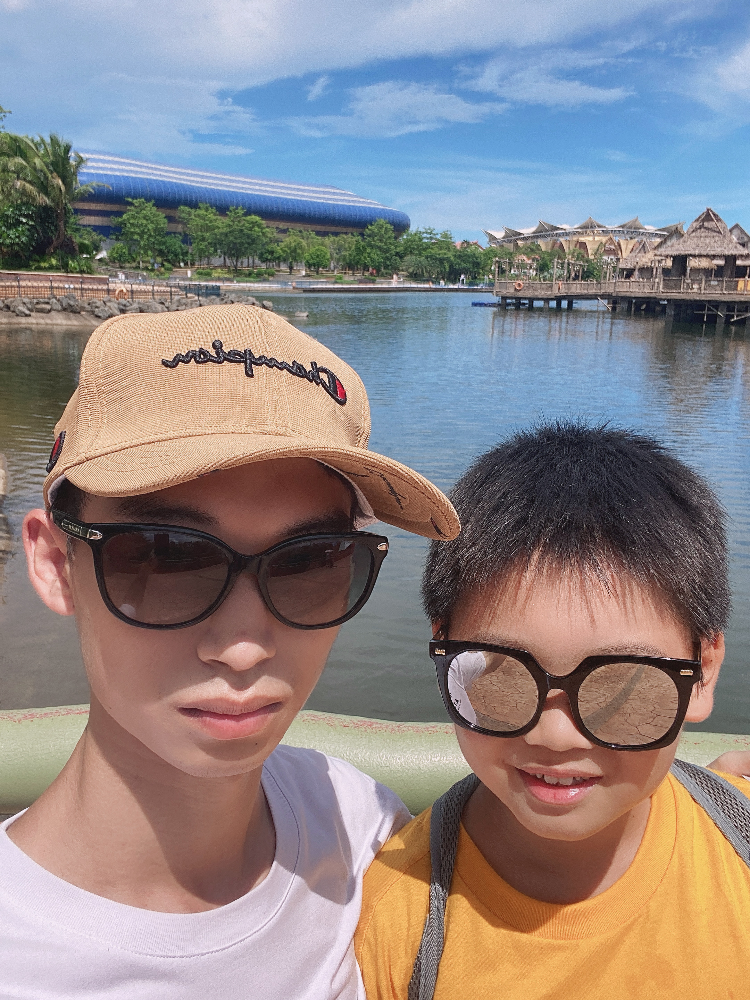

<!DOCTYPE html>
<html lang="en">

<!-- === Header Starts === -->
<head>
  <meta http-equiv="Content-Type" content="text/html; charset=UTF-8">
  <meta name="viewport" content="width=device-width, initial-scale=1">
  <meta name="description" content="Haochen Wang's homepage.">
  <meta name="keywords" content="Haochen Wang, Haochen, Zhaoxiang Zhang,
                                 SJTU, CASIA,
                                 Deep Learning, Computer Vision,
                                 Segmentation, Semi-Supervised Learning, SSL, Domain Adaptation, UDA, DA">
  <meta name="author" content="Haochen Wang">

  <title>Haochen Wang</title>

  <link rel="stylesheet" type="text/css" href="assets/font-awesome-4.7.0/css/font-awesome.min.css">
  <link rel="stylesheet" type="text/css" href="assets/academicons-1.8.6/css/academicons.min.css">
  <!-- <link rel="stylesheet" type="text/css" href="assets/bootstrap-4.3.1-dist/css/bootstrap.min.css"> -->
  <link rel="stylesheet" type="text/css" href="assets/style.css">
  <link rel="icon" type="image/png" href="assets/figures/icon.png">
  <link rel="apple-touch-icon" type="image/png" href="assets/figures/large-icon.png">
</head>
<!-- === Header Ends === -->

<body data-new-gr-c-s-check-loaded="14.1014.0" data-gr-ext-installed="">

<!-- === Homepage Starts === -->
<table width="980px" align="center" border="0">
<tbody>
<tr>

<td></td>  <!-- Leave one column blank on the left. -->
<td valign="top">

<!-- === Avatar Starts === -->
 
<table style="font-size: 12pt;" width="100%" border="0">
<tbody>
  <tr>
    <td width="30%">
      
    </td>

    <td>
      

        <h1>
          <strong>Haochen Wang</strong> 
          <small>University of Chinese Academy of Sciences</small>
          </h1>
            

                    Institute of Automation, Chinese Academy of Sciences 
                    Beijing, 100190, P.R.China
                

                
Email: <code>wanghaochen2022[at]ia.ac.cn</code>

        		

                  [<a href="https://github.com/Haochen-Wang409" target="_blank">Github</a>]
                  [<a href="https://scholar.google.com/citations?user=oNlpTdcAAAAJ&hl=zh-CN" target="_blank">Google Scholar</a>]
                

            

    </td>
  </tr>
</tbody>
</table>
<!-- === Avatar Ends === -->

<!-- === Biography Starts === -->
 
<h2>Biography</h2>

  

  Haochen Wang is currently a first year Ph.D. student at
  <a href="http://english.ia.cas.cn/" target="_blank">Institute of Automation</a>,
  <a href="https://english.cas.cn/" target="_blank">Chinese Academy of Sciences</a>,
  under the supervision of Prof.
  <a href="https://zhaoxiangzhang.net/" target="_blank">Zhaoxiang Zhang</a>.
    
  Before that, he got his Bachelor's degree in Industrial Engineering from
  <a href="https://me.sjtu.edu.cn/en/" target="_blank">School of Mechanical Engineering</a>,
  <a href="https://en.sjtu.edu.cn/" target="_blank">Shanghai Jiao Tong University</a> at June 2022.
  

  

  His research focuses on computer vision and pattern recognition,
  particularly on the following topics:
  <ul>
    <li>Image Understanding: Semantic Segmentation</li>
    <li>Label-Efficient Learning: Semi-Supervised Learning, Domain Adaptation, Active Learning</li>
    <li>Unsupervised Representation Learning: Instance Discrimination, Masked Image Modeling</li>
  </ul>
  

<!-- === Biography Ends === -->

<!-- === News Starts === -->
 
<h2>News</h2>
<ul style="font-size: 12pt; text-align: justify;">
<table>
<tbody>
  <tr>
    <td width="30%">
      <code>05/2022</code>
    </td>
    <td>
      One paper is accepted by <strong>NeurIPS 2022</strong>!
    </td>
  </tr>

  <tr>
    <td width="30%">
      <code>06/2022</code>
    </td>
    <td>
      Join Megvii as a research intern.
    </td>
  </tr>

  <tr>
    <td width="30%">
      <code>03/2022</code>
    </td>
    <td>
      One paper is accepted by <strong>CVPR 2022</strong>!
    </td>
  </tr>

  <tr>
    <td width="30%">
      <code>06/2021</code>
    </td>
    <td>
      Join SenseTime as a research intern.
    </td>
  </tr>
</tbody>
</table>

</ul>
<!-- === News Ends === -->

<!-- === Publication Starts === -->
 
<h2> Publications </h2>
<table cellspacing="17">
<tbody>
  <tr>
    <td width="25%">
      
    </td>
    <td>
      <strong>Learning from Future: A Novel Self-Training Framework for Semantic Segmentation</strong>

       <small>
      <a href="https://usr922.github.io/" target="_blank">Ye Du</a>,
      <a href="https://shenyujun.github.io/" target="_blank">Yujun Shen</a>,
      <strong>Haochen Wang</strong>,
      <a href="https://scholar.google.com.hk/citations?hl=zh-CN&user=vSM7n_UAAAAJ" target="_blank">Jingjing Fei</a>,
      <a href="https://bigballon.github.io/" target="_blank">Wei Li</a>,
      <a href="https://scholar.google.com.hk/citations?hl=zh-CN&user=dg1JyaUAAAAJ" target="_blank">Liwei Wu</a>,
      <a href="https://scholar.google.com.hk/citations?hl=zh-CN&user=1c9oQNMAAAAJ" target="_blank">Rui Zhao</a>,
      Zehua Fu,
      <a href="https://scholar.google.com/citations?hl=zh-CN&user=HsLdRZYAAAAJ" target="_blank">Qingjie Liu</a>,

       
      [<a href="https://arxiv.org/pdf/2209.06993.pdf" target="_blank">Paper (NeurIPS 2022)</a>]
      [<a href="https://github.com/usr922/FST" target="_blank">Code</a>]
      </small>

    </td>
  </tr>

  <tr>
    <td width="25%">
      
    </td>
    <td>
      <strong>Semi-Supervised Semantic Segmentation Using Unreliable Pseudo-Labels</strong>

       <small>
      Yuchao Wang*,
      <strong>Haochen Wang*</strong>,
      <a href="https://shenyujun.github.io/" target="_blank">Yujun Shen</a>,
      <a href="https://scholar.google.com.hk/citations?hl=zh-CN&user=vSM7n_UAAAAJ" target="_blank">Jingjing Fei</a>,
      <a href="https://bigballon.github.io/" target="_blank">Wei Li</a>,
      Guoqiang Jin,
      <a href="https://scholar.google.com.hk/citations?hl=zh-CN&user=dg1JyaUAAAAJ" target="_blank">Liwei Wu</a>,
      <a href="https://scholar.google.com.hk/citations?hl=zh-CN&user=1c9oQNMAAAAJ" target="_blank">Rui Zhao</a>,
      <a href="https://scholar.google.com.hk/citations?hl=zh-CN&user=MGZyMf4AAAAJ" target="_blank">Xinyi Le</a>

       
      [<a href="https://arxiv.org/pdf/2203.03884.pdf" target="_blank">Paper (CVPR 2022)</a>]
      [<a href="https://haochen-wang409.github.io/U2PL/" target="_blank">Project Page</a>]
      [<a href="https://github.com/Haochen-Wang409/U2PL" target="_blank">Code</a>]
      </small>

    </td>
  </tr>

</tbody>
</table>
<!-- === Publication Ends === -->

<!-- === Experiences Starts === -->
 
<h2>Experiences</h2>
<ul style="font-size: 12pt; text-align: justify;">
<table>
<tbody>
  <tr>
    <td width="30%">
      <code>06/2022 - 09/2022</code>
    </td>
    <td>
      Research intern at <a href="https://megvii.com/" target="_blank">Megvii</a>.
    </td>
  </tr>
  
  <tr>
    <td width="30%">
      <code>06/2021 - 04/2022</code>
    </td>
    <td>
      Research intern at <a href="https://www.sensetime.com/en" target="_blank">SenseTime</a>
      under the supervision of
      <a href="https://scholar.google.com.hk/citations?hl=zh-CN&user=dg1JyaUAAAAJ" target="_blank">Liwei Wu</a> and
      <a href="https://scholar.google.com.hk/citations?hl=zh-CN&user=1c9oQNMAAAAJ" target="_blank">Rui Zhao</a>.
    </td>
  </tr>
</tbody>
</table>
</ul>
<!-- === Experiences Ends === -->

<!-- === Awards Starts === -->
 
<h2>Awards</h2>
<ul style="font-size: 12pt; text-align: justify;">
<table>
<tbody>
  <tr>
    <td width="15%">
      <code>04/2022</code>
    </td>
    <td>
      Shanghai Outstanding Graduates (top 0.5%)
    </td>
  </tr>

  <tr>
    <td width="15%">
      <code>12/2021</code>
    </td>
    <td>
      China National Scholarship (top 0.2%)
    </td>
  </tr>

  <tr>
    <td width="15%">
      <code>04/2021</code>
    </td>
    <td>
      Outstanding Winner of
      Mathematical Contest in Modeling (top 0.1%)
    </td>
  </tr>

  <tr>
    <td width="15%">
      <code>04/2021</code>
    </td>
    <td>
      Tyacht Scholarship (top 2%)
    </td>
  </tr>

  <tr>
    <td width="15%">
      <code>11/2020</code>
    </td>
    <td>
      Second Price in China National Mathematical Contest in Modeling
    </td>
  </tr>

  <tr>
    <td width="15%">
      <code>01/2020</code>
    </td>
    <td>
      Tang Lixin Scholarship (top 1%)
    </td>
  </tr>

  <tr>
    <td width="15%">
      <code>12/2017</code>
    </td>
    <td>
      Second Price in National Olympiad in Informatics in Zhejiang Province
    </td>
  </tr>

</tbody>
</table>
</ul>
<!-- === Awards Ends === -->

</td>
</tr>
</tbody>
</table>
<!-- === Homepage Ends === -->

<!-- Visitor Traffic -->

</body>
</html>
